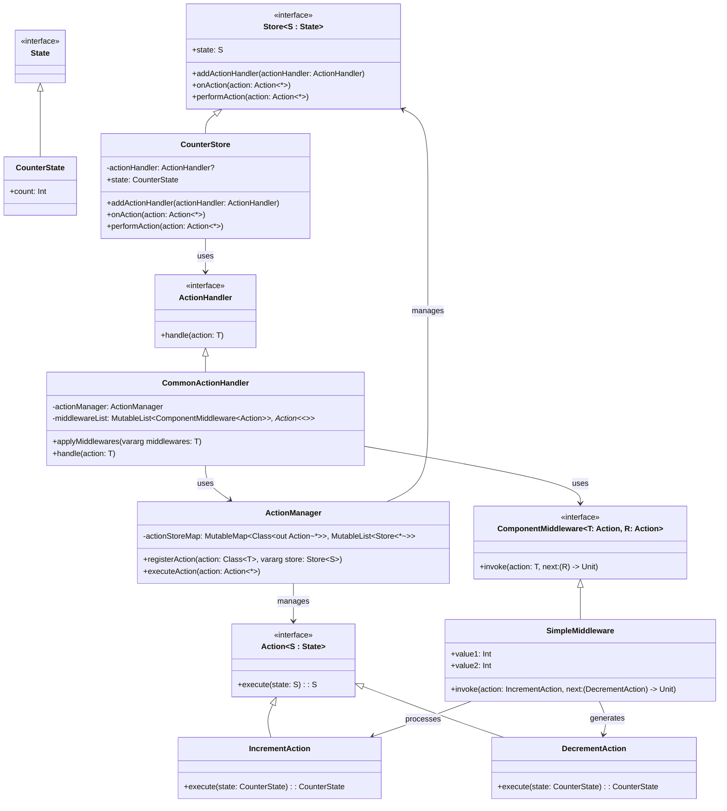
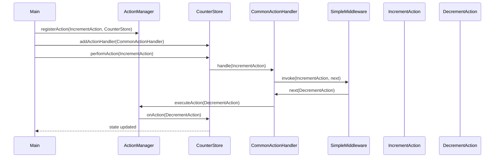

```mermaid
classDiagram
    class State {
        <<interface>>
    }

    class Store~S : State~ {
        <<interface>>
        +state: S
        +addActionHandler(actionHandler: ActionHandler)
        +onAction(action: Action~*~)
        +performAction(action: Action~*~)
    }

    class Action~S : State~ {
        <<interface>>
        +execute(state: S): S
    }

    class ActionManager {
        -actionStoreMap: MutableMap~Class~out Action~*~~, MutableList~Store~*~~~
        +registerAction(action: Class~T~, vararg store: Store~S~)
        +executeAction(action: Action~*~)
    }

    class CounterState {
        +count: Int
    }

    class IncrementAction {
        +execute(state: CounterState): CounterState
    }

    class DecrementAction {
        +execute(state: CounterState): CounterState
    }

    class CounterStore {
        -actionHandler: ActionHandler?
        +state: CounterState
        +addActionHandler(actionHandler: ActionHandler)
        +onAction(action: Action~*~)
        +performAction(action: Action~*~)
    }

    class ComponentMiddleware~T: Action, R: Action~ {
        <<interface>>
        +invoke(action: T, next: (R) -> Unit)
    }

    class SimpleMiddleware {
        +value1: Int
        +value2: Int
        +invoke(action: IncrementAction, next: (DecrementAction) -> Unit)
    }

    class ActionHandler {
        <<interface>>
        +handle(action: T)
    }

    class CommonActionHandler {
        -actionManager: ActionManager
        -middlewareList: MutableList~ComponentMiddleware~Action~*~, Action~*~~~
        +applyMiddlewares(vararg middlewares: T)
        +handle(action: T)
    }

    State <|-- CounterState
    Store <|-- CounterStore
    Action <|-- IncrementAction
    Action <|-- DecrementAction
    ComponentMiddleware <|-- SimpleMiddleware
    ActionHandler <|-- CommonActionHandler

    ActionManager --> Store : manages
    ActionManager --> Action : manages
    CounterStore --> ActionHandler : uses
    CommonActionHandler --> ActionManager : uses
    CommonActionHandler --> ComponentMiddleware : uses
    SimpleMiddleware --> IncrementAction : processes
    SimpleMiddleware --> DecrementAction : generates
```

```mermaid
sequenceDiagram
    participant Main
    participant ActionManager
    participant CounterStore
    participant CommonActionHandler
    participant SimpleMiddleware
    participant IncrementAction
    participant DecrementAction

    Main->>ActionManager: registerAction(IncrementAction, CounterStore)
    Main->>CounterStore: addActionHandler(CommonActionHandler)
    Main->>CounterStore: performAction(IncrementAction)
    CounterStore->>CommonActionHandler: handle(IncrementAction)
    CommonActionHandler->>SimpleMiddleware: invoke(IncrementAction, next)
    SimpleMiddleware->>CommonActionHandler: next(DecrementAction)
    CommonActionHandler->>ActionManager: executeAction(DecrementAction)
    ActionManager->>CounterStore: onAction(DecrementAction)
    CounterStore-->>Main: state updated
    

```